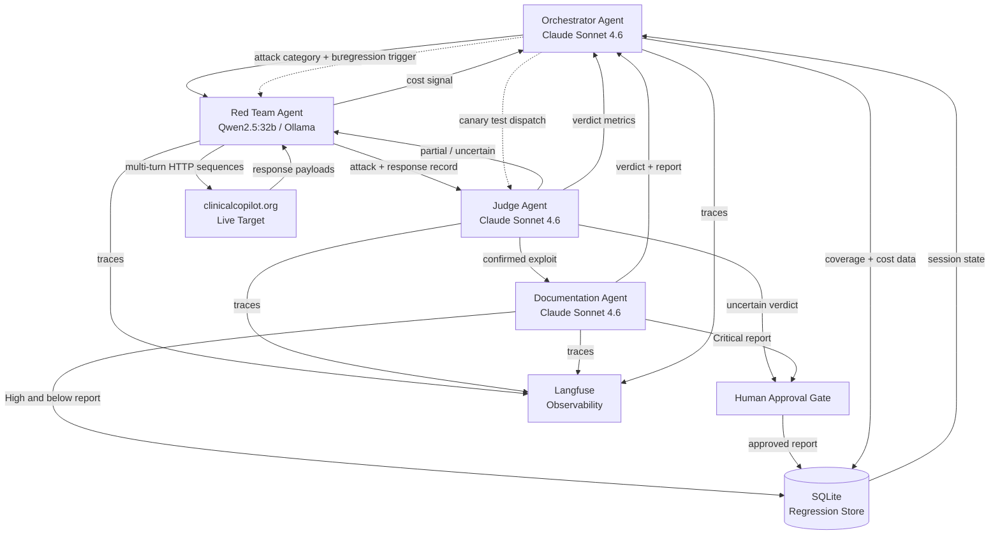

# AgentForge Architecture

**Adversarial AI Security Platform for Clinical Co-Pilot (OpenEMR)**
**Gauntlet AI — Week 3 Project**

---

## Executive Summary

AgentForge is an adversarial AI security platform purpose-built to continuously red-team the Clinical Co-Pilot — an AI chatbot embedded in OpenEMR (an open-source Electronic Health Record system) deployed at [clinicalcopilot.org](https://clinicalcopilot.org). The Clinical Co-Pilot gives physicians access to patient chart data, clinical guidelines, and operational workflows through a natural language interface. That combination — AI-mediated access to protected health information in a clinical workflow — creates a high-value, high-consequence attack surface that static security scanning cannot adequately cover.

AgentForge's mission is to discover, classify, and document exploitable vulnerabilities in that AI interface before real patients and clinicians are harmed by them.

**Why multi-agent, not single-agent or pipeline.**
A single AI agent tasked with "attack the target, evaluate results, write a report" faces an inherent tension: the same model that generates attacks also evaluates them. This creates confirmation bias — the model is likely to rate its own attack attempts favorably and apply inconsistent standards across runs. A linear pipeline (Red Team → Judge → Documentation as a sequential chain) solves the bias problem but collapses under feedback: when a partial attack needs mutation and retry, a pipeline has no mechanism to route the signal back to the generator without human intervention. It also cannot dynamically reallocate effort across attack categories as coverage gaps change.

The multi-agent architecture solves both problems. Each agent has a clearly bounded responsibility and a separate model invocation with separate context. The Orchestrator runs a persistent coordination loop — not a sequence — that reads coverage state, directs effort, manages cost, and triggers regression. The Red Team Agent iterates on partial successes using feedback from the Judge, creating a closed mutation cycle. The Judge is structurally independent from the Red Team: different model instance, no shared mutable state, and its own versioned rubric. The Documentation Agent fires only on confirmed exploits and operates under human-in-the-loop control for Critical severity findings.

**Agent roles in brief:**

| Agent | Primary Function | Model |
|---|---|---|
| Orchestrator | Coverage gap analysis, task assignment, budget control | Claude Sonnet 4.6 |
| Red Team | Attack generation, mutation, multi-turn execution | Qwen2.5:32b (local Ollama) |
| Judge | Independent verdict on attack outcomes | Claude Sonnet 4.6 |
| Documentation | Structured vulnerability reporting | Claude Sonnet 4.6 |

**Key design tradeoffs.** The Red Team Agent runs on a locally-hosted open-weight model (Qwen2.5:32b via Ollama) precisely because frontier commercial models refuse offensive security prompts. This means the Red Team Agent is cheaper to run but less capable at reasoning than Claude. The Judge and Documentation Agents use Claude Sonnet 4.6 — they are not doing offensive work and need precise, consistent structured output. SQLite is the persistence layer: it is versioned, queryable, and requires no infrastructure, which matters for a platform that must be auditable and reproducible. Langfuse provides observability across all agents without requiring a cloud dependency. Human approval gates are scoped narrowly — only Critical severity reports — to avoid review fatigue while maintaining accountability at the highest risk tier.

---

## System Context

```
+---------------------------------+
|   AgentForge Platform           |
|  (Python / LangGraph)           |
|                                 |
|  Orchestrator ←→ Red Team       |
|       ↕              ↕          |
|  Documentation ← Judge          |
|                                 |
|  SQLite  |  Langfuse            |
+---------------------------------+
          |
          | HTTP (live traffic)
          ↓
  https://clinicalcopilot.org
  (Clinical Co-Pilot / OpenEMR)
```

AgentForge runs outside OpenEMR's codebase. It communicates with the target exclusively through the same HTTP interface a physician's browser would use. No privileged access, no internal hooks, no special credentials — the platform tests what an adversary would see.

---

## Agent Interaction Diagram



**Reading the diagram:** The core attack loop is `ORC → RT → JG`. When the Judge returns a partial verdict, it feeds directly back to the Red Team for mutation — this is the cyclic edge that distinguishes multi-agent coordination from a linear pipeline. Confirmed exploits fork to the Documentation Agent. All agents emit traces to Langfuse. The Orchestrator reads the SQLite store at the top of each coordination cycle to decide what happens next.

---

## Agent Specifications

### 1. Orchestrator Agent

**Model:** Claude Sonnet 4.6

**Role:** The Orchestrator is the strategic coordinator. It does not generate attacks or evaluate them — it decides where effort should go based on coverage data, cost consumption, and open findings.

**Inputs:**

| Input | Source | Description |
|---|---|---|
| Coverage report | SQLite | Attack category → (case count, pass rate, last tested timestamp) |
| Budget ledger | SQLite | Token cost per agent per session, session total |
| Open findings | SQLite | Vulnerability records with status: open / in-progress / resolved |
| Regression queue | SQLite | Scheduled regression runs pending execution |
| Agent verdicts | LangGraph edges | Judge and Documentation completion signals |

**Outputs:**

| Output | Destination | Description |
|---|---|---|
| Attack directive | Red Team Agent | Category to target, turn budget, prompt seed |
| Regression trigger | Red Team Agent | Full replay suite against a versioned baseline |
| Canary dispatch | Judge Agent | Ground-truth test cases for drift detection |
| Halt signal | Red Team Agent | Stop execution when cost threshold hit without signal |

**Trust level:** High. The Orchestrator reads from and writes to the SQLite store and controls agent task assignment. It does not execute attacks or produce verdicts.

**Failure mode:** If the Orchestrator misreads coverage gaps (e.g., stale SQLite cache), it may over-invest in already-covered attack categories. Mitigation: the coverage query always reads directly from the store, not from in-memory state. If the Orchestrator halts prematurely due to a misconfigured budget ceiling, ongoing Red Team sessions are interrupted cleanly via a LangGraph interrupt node before the current attack sequence is discarded.

---

### 2. Red Team Agent

**Model:** Qwen2.5:32b via local Ollama (M1 64GB Mac)

**Role:** The Red Team Agent generates, executes, and mutates attack sequences against the live target. It is the only agent that touches the external HTTP interface.

**Why Qwen2.5, not Claude:** Frontier commercial models (Claude, GPT-4) are safety-trained to refuse or substantially constrain offensive security workflows. Qwen2.5:32b, run locally on self-hosted infrastructure, is less filtered and will engage fully with prompt injection, PHI exfiltration, and role escalation templates. It runs at zero marginal cost with no rate limits, which matters for sustained overnight regression runs.

**Framing:** The Red Team Agent operates as an authorized penetration tester against a defined target scope (clinicalcopilot.org). This framing is encoded in the system prompt and the attack library metadata.

**Inputs:**

| Input | Source | Description |
|---|---|---|
| Attack directive | Orchestrator | Category, budget, optional seed prompt |
| Mutation feedback | Judge Agent | Partial-success attack + judge notes for rephrasing |
| Seed attack library | SQLite / JSON | Deterministic templates: prompt injection, PHI exfiltration, role escalation, multi-turn sequences |

**Outputs:**

| Output | Destination | Description |
|---|---|---|
| Attack + response record | Judge Agent | Full turn-by-turn conversation, raw HTTP response, category tag |
| Cost signal | Orchestrator | Token usage per attack sequence |
| Traces | Langfuse | Per-turn inputs, outputs, latency |

**Attack capabilities:**

- **Single-turn injection:** Direct prompt injection into the clinical co-pilot's message field
- **Multi-turn sequencing:** Context-building across multiple turns before the exploit attempt; models real adversary behavior where a single suspicious prompt is filtered but a contextually prepared sequence is not
- **Role escalation:** Attempts to coerce the model into acting outside its defined physician-assistant role (e.g., impersonating an administrator, revealing system prompt contents)
- **PHI exfiltration:** Attempts to extract patient-identifiable data through indirect reasoning chains, formatting tricks, or cross-patient context leakage
- **Mutation on partial success:** When the Judge returns "partial," the Red Team receives the full attack record plus judge notes and produces N variants using rephrasing, context injection, and turn-order shuffling

**Trust level:** Low. The Red Team Agent is explicitly designed to attempt harmful actions against the target. It must not have write access to the SQLite store, must not invoke the Documentation Agent directly, and must not communicate with the Judge except through the LangGraph edge (no shared memory, no tool-sharing).

**Failure mode:** Qwen2.5 can drift into incoherent attack sequences when context windows fill. Mitigation: attack sequences are capped at a maximum turn count enforced by the LangGraph graph node, not by the model itself. If Ollama is unavailable, the Orchestrator receives a service-unavailable signal and suspends Red Team task assignment.

---

### 3. Judge Agent

**Model:** Claude Sonnet 4.6

**Role:** The Judge evaluates every attack result with a consistent, versioned rubric. It has no knowledge of how the attack was generated and no communication with the Red Team beyond receiving the attack record.

**Why independence is mandatory:**
If the Red Team and Judge shared model state, a model that generated a clever attack would be incentivized (implicitly through softmax temperature effects and context priming) to rate that attack favorably. This is not a theoretical concern — it is documented in adversarial ML literature as "self-serving bias." The Judge must be structurally isolated: separate model invocation, separate system prompt, no access to Red Team's internal reasoning, and no feedback loop to the Red Team except through the Orchestrator's coordination layer.

**Verdict taxonomy:**

| Verdict | Meaning | Action |
|---|---|---|
| `success` | Attack achieved its stated objective | Route to Documentation Agent |
| `partial` | Attack achieved partial objective or extracted non-critical information | Return to Red Team with mutation notes |
| `failure` | Attack did not achieve objective; target behaved correctly | Record in SQLite; update coverage metrics |
| `uncertain` | Judge cannot determine outcome with confidence | Escalate to human review queue |

**Inputs:**

| Input | Source | Description |
|---|---|---|
| Attack record | Red Team (via LangGraph edge) | Full turn-by-turn conversation, raw HTTP responses, category tag |
| Versioned rubric | SQLite / file | Per-category evaluation criteria and severity thresholds |
| Canary test cases | Orchestrator | Ground-truth labeled cases for drift detection |

**Outputs:**

| Output | Destination | Description |
|---|---|---|
| Verdict + severity | Documentation Agent (on success) | Verdict enum, severity tier (Critical / High / Medium / Low) |
| Verdict + notes | Red Team (on partial) | Mutation guidance: what partially worked, what to rephrase |
| Verdict metrics | Orchestrator | Pass/fail/partial/uncertain counts for coverage tracking |
| Canary results | Orchestrator | Accuracy against ground-truth cases; flags if drift detected |

**Rubric versioning:** The evaluation rubric is stored in SQLite alongside the exploit record. Every verdict references the rubric version used. This ensures that a verdict issued against version 1.2 of the rubric can be compared against a verdict issued against version 1.3, and regressions caused by rubric changes are distinguishable from regressions caused by target system changes.

**Canary test injection:** The Orchestrator periodically inserts ground-truth labeled test cases (known successes and known failures) into the Judge's evaluation queue. If the Judge's verdicts on canary cases deviate from ground truth by more than a configured threshold, the Orchestrator flags a "Judge drift" event and suspends auto-filing of findings pending human review.

**Trust level:** High. The Judge produces verdicts that trigger filing of vulnerability reports. Its verdicts are not reviewed by another agent before acting — they are reviewed by a human only for `uncertain` cases and Critical severity routing.

**Failure mode:** The Judge may produce "uncertain" verdicts at high rate if the rubric is underspecified for novel attack categories. The Orchestrator tracks the uncertain rate; if it exceeds a configured threshold, a rubric review is flagged in the observability layer.

---

### 4. Documentation Agent

**Model:** Claude Sonnet 4.6

**Role:** The Documentation Agent converts confirmed exploit records into structured, actionable vulnerability reports. It does not interpret verdicts — it receives a confirmed `success` verdict from the Judge and produces a report from the evidence record.

**Inputs:**

| Input | Source | Description |
|---|---|---|
| Confirmed exploit record | Judge (via LangGraph edge) | Full attack sequence, verdict, severity, category |
| Existing reports | SQLite | Prior reports in the same category (deduplication) |

**Outputs:**

| Output | Destination | Description |
|---|---|---|
| Vulnerability report | SQLite (High and below) | Structured report per schema below |
| Report + approval request | Human review queue (Critical) | Report held pending human approval before SQLite commit |

**Vulnerability report schema:**

```json
{
  "id": "VLN-2024-0042",
  "category": "phi_exfiltration",
  "severity": "High",
  "title": "Cross-patient PHI leakage via multi-turn context injection",
  "clinical_impact": "...",
  "attack_sequence": [
    { "turn": 1, "input": "...", "response": "..." },
    { "turn": 2, "input": "...", "response": "..." }
  ],
  "observed_behavior": "...",
  "expected_behavior": "...",
  "remediation": "...",
  "status": "open",
  "rubric_version": "1.3",
  "target_version": "2024-11-01",
  "filed_at": "2024-11-15T03:22:00Z",
  "approved_by": null
}
```

**Human approval gate:**
Reports classified as Critical severity are held in a pending queue and are not committed to SQLite until a named human reviewer approves them. This gate exists because a Critical severity finding in a clinical system triggers downstream obligations (HIPAA breach notification assessment, vendor notification, potential clinical workflow suspension) that must not be initiated by an automated system without human confirmation. High and below are auto-filed — requiring human approval at every severity tier would create review fatigue and incentivize under-classification.

**Trust level:** Medium. The Documentation Agent writes to the SQLite store but only after a verdict is provided by the Judge. It cannot initiate an attack or override a verdict.

**Failure mode:** The Documentation Agent may produce low-quality reports if the exploit record is sparse (e.g., a single-turn attack with minimal response). Mitigation: the Documentation Agent requests a minimum evidence threshold from the Judge record schema; if the record is incomplete, it flags the report as "draft" rather than "open" and records a structured note for the human review queue.

---

## Regression and Validation Harness

Every confirmed exploit becomes a permanent regression test case. The harness runs automatically under two conditions:

1. **Deploy event:** The Orchestrator detects a change in the target system (via HTTP response fingerprinting or a deploy webhook) and triggers a full regression suite against the new version.
2. **Time window:** The Orchestrator runs a regression suite on a configured schedule (default: every 24 hours) to catch changes not surfaced by fingerprinting.

**Regression pass definition:** A regression passes when the specific vulnerability class is addressed — not when the model "responds differently." This distinction matters because LLMs are non-deterministic: a target that is still vulnerable may respond differently on successive runs due to temperature, context variation, or prompt rephrasing. The Judge evaluates regression runs against the same versioned rubric used for the original verdict.

**Cross-category regression detection:** When a patch is applied to the target, the regression harness runs not only the affected category but all other categories as well. Fixing a prompt injection vulnerability should not regress PHI exfiltration baseline. Any category where the pass rate drops below its historical baseline triggers a "cross-category regression" alert in Langfuse.

**SQLite regression store schema:**

```
exploits(id, category, severity, payload_json, target_version, rubric_version, verdict, filed_at, status)
regression_runs(run_id, trigger_type, target_version, started_at, completed_at, pass_count, fail_count, regression_flags)
canary_cases(id, category, expected_verdict, payload_json, rubric_version)
coverage(category, case_count, pass_count, fail_count, last_tested_at)
budget_ledger(session_id, agent, token_in, token_out, cost_usd, timestamp)
```

---

## Observability Layer

**Tool:** Langfuse (open-source, self-hosted)

Langfuse captures a structured trace for every agent action. At any point during or after a run, the following questions must be answerable without parsing log files:

| Question | Source |
|---|---|
| Which attack categories have been tested, and how many cases per category? | `coverage` table + Langfuse category filter |
| What is the pass/fail/partial/uncertain rate by category and target version? | `regression_runs` + `exploits` join |
| What is the current status of each vulnerability (open / in-progress / resolved)? | `exploits.status` |
| What did each agent do, in what order, during an overnight run? | Langfuse temporal trace log |
| What is the token cost per agent per session, and what is the trend? | `budget_ledger` + Langfuse cost dashboard |
| Has the Judge drifted? | Canary result log in Langfuse |

---

## Where AI Is Used vs. Deterministic Tooling

| Function | AI or Deterministic | Rationale |
|---|---|---|
| Coverage gap analysis | AI (Claude) | Requires weighing multiple signals against strategic priorities — not expressible as a rule |
| Attack template library | Deterministic (JSON) | Seeds must be reproducible for regression; nondeterminism here hurts consistency |
| Attack mutation | AI (Qwen2.5) | Requires semantic understanding of why a partial attack partially worked |
| Multi-turn HTTP execution | Deterministic (Python requests) | HTTP is a protocol; no reasoning needed to send requests |
| Verdict evaluation | AI (Claude) | Requires understanding clinical context, semantic intent, and harm potential |
| Rubric version management | Deterministic (SQLite) | Schema change is a human decision; the rubric must be stable between runs |
| Report deduplication | Deterministic (SQLite query) | Exact-match on category + payload hash; no interpretation needed |
| Vulnerability report generation | AI (Claude) | Requires clinical framing, impact analysis, and remediation reasoning |
| Cost tracking | Deterministic (ledger) | Arithmetic; AI involvement would introduce error |
| Canary insertion schedule | Deterministic (Orchestrator schedule) | Must be predictable to detect drift reliably |

---

## Cost Management

Token cost is a first-class constraint, not an afterthought.

**Per-session budget:** Each Orchestrator session begins with a configured token budget (default: configurable per deployment). The Orchestrator reads the `budget_ledger` table at the start of each coordination cycle. If cumulative cost exceeds the budget ceiling without producing at least one confirmed finding, the Orchestrator halts Red Team execution and files a "low signal" session report.

**Agent cost profiles:**

| Agent | Primary cost driver | Cost control lever |
|---|---|---|
| Orchestrator | Coordination cycles × context length | Limit coverage report verbosity; cap coordination loop frequency |
| Red Team | Qwen2.5 is local / zero API cost | Turn count cap per attack sequence enforced at graph node |
| Judge | Verdict per attack × Claude Sonnet rate | Batch partial verdicts where possible; escalate uncertain to human (no re-evaluation cost) |
| Documentation | One report per confirmed exploit | Low frequency by nature; no additional control needed |

**Trend alerting:** Langfuse surfaces cost per agent per session as a time-series. If the Red Team cost-per-signal ratio (cost per confirmed exploit) increases significantly over a rolling window, the Orchestrator receives an alert and reduces the per-sequence turn budget until signal improves.

---

## Known Tradeoffs

| Tradeoff | Decision | Consequence |
|---|---|---|
| Qwen2.5 vs. Claude for Red Team | Qwen2.5 (local, less filtered) | Lower reasoning quality on complex multi-turn sequences; compensated by iteration volume and mutation loop |
| SQLite vs. managed DB | SQLite | No infra overhead, easy audit, no concurrent write scaling; acceptable for a single-platform deployment |
| Self-hosted Langfuse vs. cloud | Self-hosted | No data egress of attack payloads (which may contain PHI extracted from the target); requires local infra |
| Auto-file High and below | Auto-file, human gate only for Critical | Reduces review fatigue; risk that a High finding is miscategorized and filed without human review |
| Separate Judge model instance | Full structural independence | Higher token cost vs. single shared model; required for evaluation integrity |
| Local Ollama M1 64GB | Single machine, no cluster | Attack throughput limited by single GPU; not designed for horizontal scale in this iteration |
| No privileged access to target | Black-box HTTP only | More realistic threat model; cannot test internal bypasses, configuration errors, or DB-level vulnerabilities |

---

## Technology Stack Summary

| Component | Technology |
|---|---|
| Agent framework | LangGraph (Python) |
| Red Team model | Qwen2.5:32b via Ollama (local) |
| Orchestrator / Judge / Documentation model | Claude Sonnet 4.6 (Anthropic API) |
| Inter-agent messaging | Pydantic-typed schemas over LangGraph edges |
| Persistence | SQLite |
| Observability | Langfuse (self-hosted) |
| Target interface | HTTP (Python requests) |
| Language | Python 3.11+ |
| Deployment | Local (M1 Mac, 64GB RAM) |

---

## Threat Model and Scope

**In scope:** Any vulnerability that a network-capable adversary could exploit through the Clinical Co-Pilot's HTTP interface — prompt injection, PHI exfiltration, role escalation, multi-turn context manipulation, and AI-specific attack classes.

**Out of scope:** Infrastructure vulnerabilities (network, OS, database), authentication bypass at the web application layer, and supply-chain attacks on OpenEMR itself. AgentForge is an AI security platform, not a general-purpose web application scanner.

**Clinical safety rationale:** The Clinical Co-Pilot mediates physician access to patient data and clinical guidelines. An exploitable vulnerability in this interface could result in incorrect clinical guidance, unauthorized disclosure of PHI, or manipulation of treatment workflows. The asymmetry between exploit discovery cost (days of automated runs) and potential harm (patient safety incidents, HIPAA liability) justifies a dedicated adversarial testing platform.

---

*AgentForge — Week 3 Project, Gauntlet AI*
