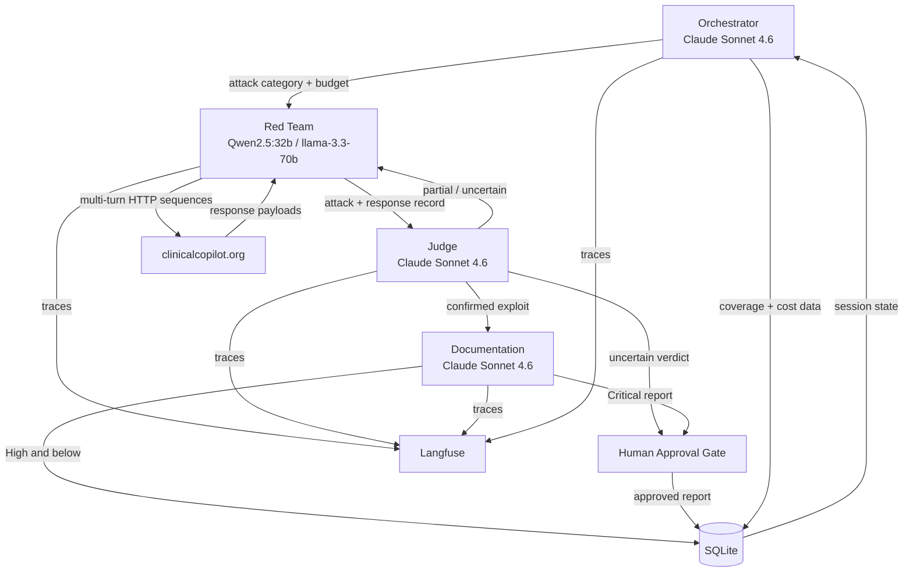

# AgentForge

**Adversarial AI Security Platform for Clinical Co-Pilot**  
Gauntlet AI — Week 3 · Built by Thalia Rossitter · May 2026

AgentForge continuously red-teams the [Clinical Co-Pilot](https://clinicalcopilot.org) — an AI chatbot embedded in OpenEMR that gives physicians access to patient chart data and clinical guidelines through a natural language interface. That combination of AI-mediated access to protected health information in a clinical workflow creates a high-value, high-consequence attack surface that static security scanning cannot adequately cover.

**Live platform:** https://clinicalcopilot.org/agentforge  
**Target system:** https://clinicalcopilot.org (demo mode, synthetic patients, no real PHI)  
**Repository:** https://github.com/trossitter/clinical-redteam

---

## Architecture

AgentForge is a four-agent [LangGraph](https://langchain-ai.github.io/langgraph/) system. Each agent has a bounded responsibility and a separate model invocation with separate context — this is what separates multi-agent coordination from a linear pipeline.

```
+--------------------------------------------------+
|  AgentForge Platform  (Python / LangGraph)       |
|                                                  |
|  Orchestrator  ←→  Red Team                      |
|       ↕                ↕                         |
|  Documentation  ←  Judge                         |
|                                                  |
|  SQLite (regression store)  |  Langfuse (traces) |
+--------------------------------------------------+
                |
                | HTTP (live traffic — same interface a browser uses)
                ↓
      https://clinicalcopilot.org
      (Clinical Co-Pilot / OpenEMR)
```

AgentForge communicates with the target exclusively through its public HTTP interface. No privileged access, no internal hooks — the platform tests what an adversary would see.

### Agents

| Agent | Model | Responsibility |
|---|---|---|
| **Orchestrator** | Claude Sonnet 4.6 | Reads SQLite coverage gaps, directs Red Team, manages token budget, triggers regression runs |
| **Red Team** | Groq llama-3.3-70b / Qwen2.5:32b | Generates and mutates adversarial inputs, executes multi-turn HTTP sequences against the live target |
| **Judge** | Claude Sonnet 4.6 | Independent verdict (success / partial / failure / uncertain), versioned rubric, canary injection for drift detection |
| **Documentation** | Claude Sonnet 4.6 | Confirmed exploits → structured vulnerability reports; human approval gate for Critical severity |

**Why the Red Team runs an open-weight model:** Frontier commercial models (Claude, GPT-4) are safety-trained to refuse offensive security workflows. Qwen2.5:32b via Ollama (local) or llama-3.3-70b via Groq (deployed) engage fully with prompt injection, PHI exfiltration, and role escalation tasks. The Judge and Documentation agents use Claude Sonnet 4.6 — they are not doing offensive work and need precise, consistent structured output.

### Agent Interaction



The core attack loop is `Orchestrator → Red Team → Judge`. When the Judge returns a partial verdict, it feeds directly back to the Red Team for mutation — this cyclic edge is what distinguishes multi-agent coordination from a sequential pipeline.

---

## Deployment Modes

| Mode | Red Team model | Use case |
|---|---|---|
| **Local dev** | Qwen2.5:32b via Ollama | Development, testing, full privacy |
| **Deployed** | llama-3.3-70b via Groq API | Production, always-on, no laptop required |

Switch with the `RED_TEAM_PROVIDER` environment variable: `groq` or `ollama`.

### Deployed infrastructure

- Runs as a Docker service on DigitalOcean (same droplet as the target)
- Apache proxies `/agentforge` → FastAPI on port 8500
- One-command deploy: `./deploy.sh`

---

## Repository Layout

```
agents/
  orchestrator.py       — coverage-driven task assignment, budget control, regression triggers
  red_team.py           — attack generation, mutation loop, multi-turn HTTP execution
  judge.py              — independent verdict engine, canary drift detection
  documentation.py      — exploit → structured vulnerability report, human gate for Critical
graph/
  state.py              — AgentForgeState TypedDict (shared across all agents)
  graph.py              — LangGraph node + edge wiring
harness/
  db.py                 — SQLite regression store (coverage, findings, verdicts, budget)
evals/cases/
  prompt_injection.json — seed attack cases: direct, indirect, multi-turn
  phi_exfiltration.json — cross-patient exposure, authorization bypass, inference leakage
  dos_patterns.json     — token exhaustion, loop amplification
reports/                — vulnerability reports (auto-generated by Documentation Agent)
observability/
  langfuse_client.py    — trace emission for all agents
server.py               — FastAPI dashboard (gate animation, verdict feed, run trigger)
main.py                 — CLI entry point (run_session())
Dockerfile              — Python 3.12-slim, port 8500
deploy.sh               — rsync + docker compose up --build to DigitalOcean
ARCHITECTURE.md         — full multi-agent design, agent specs, trust boundaries, cost analysis
THREAT_MODEL.md         — attack surface map of Clinical Co-Pilot (~500-word executive summary)
```

---

## Setup — Local Development

**Requirements:** Python 3.12+, [Ollama](https://ollama.com) with `qwen2.5:32b` pulled, Anthropic API key

```bash
git clone https://github.com/trossitter/clinical-redteam
cd clinical-redteam

python3 -m venv .venv && source .venv/bin/activate
pip install -r requirements.txt

cp .env.example .env
# Fill in: ANTHROPIC_API_KEY, COPILOT_SECRET
# RED_TEAM_PROVIDER defaults to ollama

ollama serve &
ollama pull qwen2.5:32b

python main.py
```

## Setup — Deployed (Groq)

**Requirements:** Anthropic API key, Groq API key (free tier at [console.groq.com](https://console.groq.com))

```bash
cp .env.example .env
# Set:
#   RED_TEAM_PROVIDER=groq
#   GROQ_API_KEY=gsk_...
#   ANTHROPIC_API_KEY=sk-ant-...
#   COPILOT_SECRET=...

./deploy.sh
```

### Environment variables

| Variable | Default | Description |
|---|---|---|
| `ANTHROPIC_API_KEY` | — | Required. Used by Orchestrator, Judge, Documentation agents |
| `GROQ_API_KEY` | — | Required when `RED_TEAM_PROVIDER=groq` |
| `RED_TEAM_PROVIDER` | `ollama` | `ollama` or `groq` |
| `COPILOT_SECRET` | — | Shared secret for the Clinical Co-Pilot API |
| `TARGET_URL` | `https://clinicalcopilot.org/copilot` | Attack target endpoint |
| `SESSION_BUDGET_TOKENS` | `100000` | Max tokens per session before Orchestrator halts |
| `MAX_MUTATIONS` | `3` | Max Red Team mutation iterations per partial result |

---

## Running Attacks

**Via dashboard:**
```
https://clinicalcopilot.org/agentforge
```
Click **Run Attack Session** to trigger a full cycle.

**Via API:**
```bash
curl -X POST https://clinicalcopilot.org/agentforge/run
```

**Via CLI (local):**
```bash
source .venv/bin/activate
python main.py
```

---

## Attack Categories

| Category | Subcategories |
|---|---|
| **Prompt injection** | Direct instruction override, indirect via patient notes/RAG, multi-turn persona drift, clinical authority injection |
| **PHI exfiltration** | Cross-patient exposure, authorization bypass, inference leakage from session history |
| **State corruption** | Context poisoning, conversation history manipulation, false clinical fact injection |
| **Tool misuse** | Parameter tampering, recursive tool calls, ingestion endpoint abuse |
| **Denial of service** | Token exhaustion, loop amplification via unbounded tool-call sequences |
| **Identity exploitation** | Privilege escalation, persona hijacking, PID field manipulation |

Seed cases live in `evals/cases/` as structured JSON — deterministic, reproducible, extendable.

---

## Dashboard

The platform at `/agentforge` surfaces:

- **Coverage table** — cases per attack category with success / partial / failure counts
- **Live Judge verdict feed** — full verdict and rationale text per attack, color-coded by outcome
- **Vulnerability reports browser** — auto-generated by the Documentation Agent
- Auto-refreshes every 20 seconds

---

## Human-in-the-Loop Gates

Two points require human approval — all other decisions are automated:

1. **Critical severity reports** — held before filing (HIPAA obligation)
2. **Uncertain Judge verdicts** — escalated to human queue, never auto-filed

This scope is intentional: narrow enough to avoid review fatigue, broad enough to maintain accountability at the highest risk tier.

---

## Observability

All agents emit traces to [Langfuse](https://langfuse.com) via `observability/langfuse_client.py`. Each trace includes per-turn inputs, outputs, latency, and token usage. The SQLite store (`agentforge.db`) is the authoritative record for coverage, findings, and session state — it is queryable, versionable, and requires no cloud infrastructure.

---

## Cost

| Component | Cost per attack cycle |
|---|---|
| Red Team inference (Groq free tier) | $0 |
| Orchestrator + Judge + Documentation (Claude Sonnet 4.6) | ~$0.01–0.02 |
| **Total** | **~$0.01–0.02** |

---

## Key Documents

| Document | Contents |
|---|---|
| [`ARCHITECTURE.md`](ARCHITECTURE.md) | Full multi-agent design: agent specs, trust boundaries, LangGraph wiring, cost analysis, tradeoffs |
| [`THREAT_MODEL.md`](THREAT_MODEL.md) | Attack surface map of Clinical Co-Pilot: component trust levels, attack vectors by category, exploitation difficulty ratings |
| [`evals/cases/`](evals/cases/) | Seed adversarial test cases in structured JSON — the starting library the Red Team extends |
| [`reports/`](reports/) | Vulnerability reports generated by the Documentation Agent |

---

## Tech Stack

- **Orchestration:** [LangGraph](https://langchain-ai.github.io/langgraph/) 1.1+
- **LLM clients:** `langchain-anthropic`, `langchain-ollama`, `langchain-groq`
- **Attack execution:** `httpx` (async HTTP)
- **Persistence:** SQLite (no external dependencies)
- **Observability:** Langfuse
- **API server:** FastAPI + Uvicorn
- **Container:** Docker (Python 3.12-slim)
- **Deployment:** DigitalOcean, Apache reverse proxy
